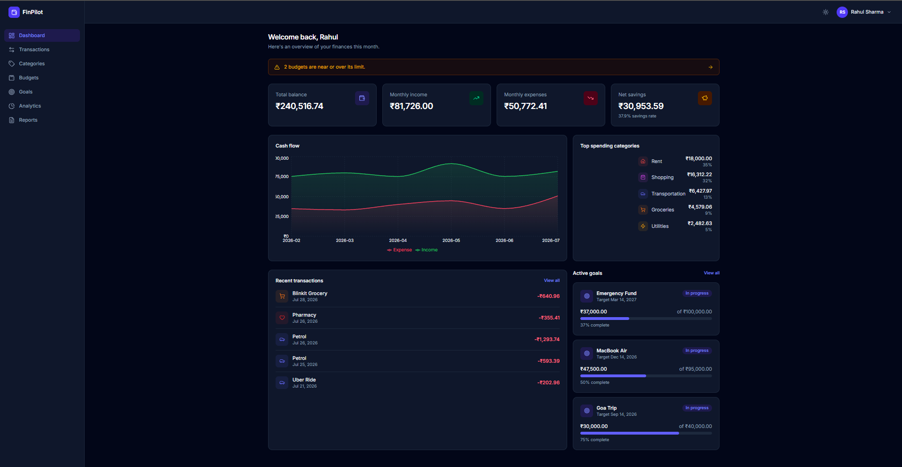
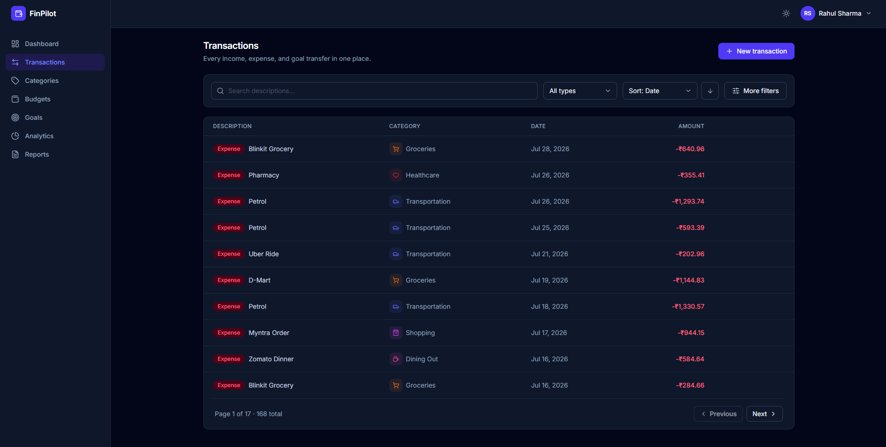
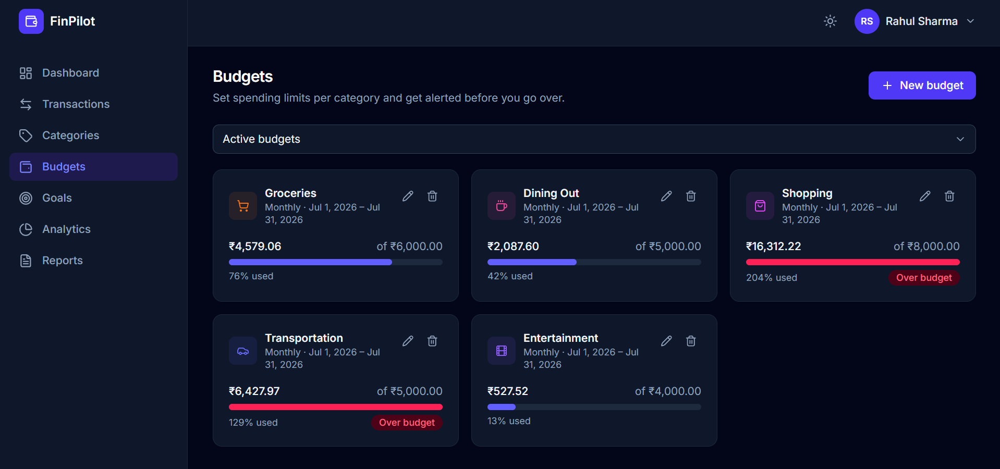
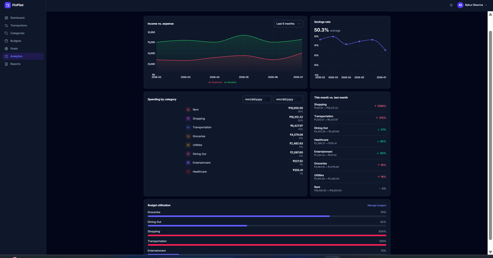
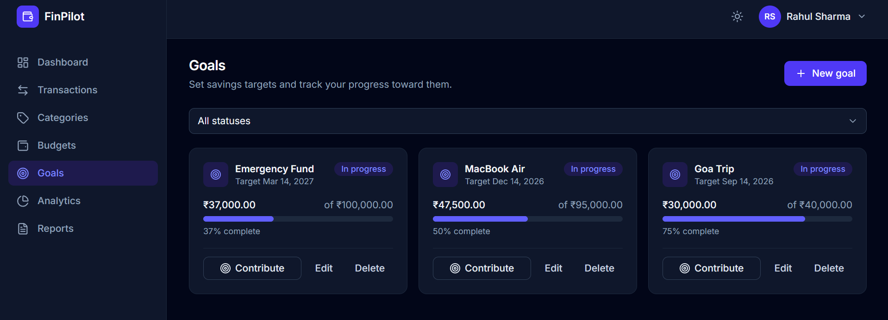
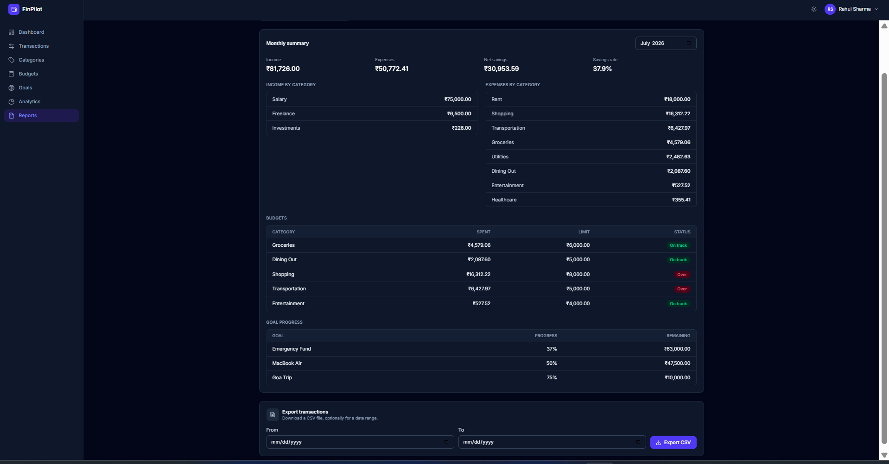

# FinPilot


FinPilot is a full-stack personal finance management application built using React, FastAPI, and PostgreSQL. It enables users to track income and expenses, manage budgets, save toward financial goals, analyze spending trends, and generate financial reports through a modern, responsive dashboard.

## Live Demo

🌐 Live Application: https://finpilot-ashy.vercel.app/

📚 Interactive Swagger Documentation: https://finpilot-api-ypf6.onrender.com/docs

> **Note:** The backend is hosted on Render's free tier, so the first request may take 30–60 seconds if the service is waking up.


## Key Features

- 🔐 JWT Authentication with refresh token rotation
- 💸 Income, expense, and transfer management
- 📊 Interactive analytics dashboard
- 📅 Smart budget tracking with configurable spending alerts
- 🎯 Goal-based savings tracker
- 📈 Monthly & yearly financial reports with CSV export
- 🧮 Compound interest & goal planning simulator

## Architecture

```text
                          ┌─────────────────────┐
                          │       Browser       │
                          └──────────┬──────────┘
                                     │
                                     │ HTTPS
                                     ▼
                        ┌────────────────────────────┐
                        │   React 19 + Vite (Vercel) │
                        │                            │
                        │ • React Router             │
                        │ • Axios                    │
                        │ • Recharts                 │
                        │ • Tailwind CSS             │
                        └───────────────────────────-┘
                                    │
                                REST API (JWT)
                                    │
                                    ▼
                        ┌─────────────────────────────┐
                        │     FastAPI (Render)        │
                        └──────────┬──────────────────┘
                                   │
            ┌──────────────────────┼──────────────────────┐
            ▼                      ▼                      ▼
        ┌─────────────┐      ┌────────────────┐     ┌────────────────┐
        │   Routers   │ ───► │    Services    │ ───►│ SQLAlchemy ORM │
        │ (Endpoints) │      │ Business Logic │     │                │
        └─────────────┘      └────────────────┘     └───────┬────────┘
                                                            │
                                                            ▼
                                                    ┌────────────────┐
                                                    │ PostgreSQL DB  │
                                                    └────────────────┘
```

### Request Flow

1. The React frontend sends authenticated REST API requests using Axios.
2. FastAPI routers validate requests and delegate work to service classes.
3. Services contain the application's business logic and interact with SQLAlchemy models.
4. SQLAlchemy communicates with PostgreSQL to persist and retrieve data.
5. Responses are returned as JSON and rendered by the React frontend.


## Project Highlights

- Secure JWT authentication with refresh token rotation
- Interactive financial dashboard with charts and insights
- Budget tracking with configurable spending alerts
- Savings goals with contribution tracking and progress visualization
- Advanced transaction management with filtering, search, sorting, and pagination
- Monthly and yearly financial reports with CSV export
- Compound interest and goal-planning simulator
- Responsive React frontend with dark mode support

## Tech Stack

| Layer | Technologies |
|-------|--------------|
| Frontend | React 19, Vite, Tailwind CSS, React Router, Axios, Recharts |
| Backend | FastAPI, SQLAlchemy, Pydantic v2, JWT, bcrypt |
| Database | PostgreSQL, Alembic |
| DevOps | Docker, Docker Compose |
| Testing | Pytest |
| Deployment | Render, Vercel |

## Deployment

| Component | Platform |
|----------|----------|
| Frontend | Vercel |
| Backend | Render |
| Database | PostgreSQL |

The frontend communicates with the deployed FastAPI backend using REST APIs. Automatic deployments are triggered whenever changes are pushed to the main branch via GitHub.


## Screenshots

**Dashboard**



**Transactions**



**Budgets**



**Analytics**



**Goals**



**Reports**



## Why I Built This

FinPilot was built to strengthen my full-stack development skills by designing and implementing a complete finance management application from scratch. The project focuses on clean architecture, authentication, business logic, database design, API development, and frontend integration rather than isolated CRUD functionality. A finance tracker forced me to think about things a simple CRUD app doesn't: how to keep a goal's balance in sync when a transaction changes, how to structure JWT auth properly, how to design a schema that supports budgets and analytics without the queries turning into a mess, and how to wire all of that up to a frontend that actually uses it. The goal wasn't simply to build another CRUD application, but to design a system with realistic business rules, layered architecture, authentication, analytics, and a production-ready deployment.

## Demo Account

```text
Email:    demo@finpilot.dev
Password: DemoPass123!
```

The seeded demo account comes preloaded with:

- Six months of realistic INR transactions
- Monthly salary, freelance income, cashback, and bank interest
- Active budgets with alerts
- Savings goals in progress
- Dashboard analytics and reports


## Quick Start

### Docker

Requires Docker and Docker Compose.

```bash
git clone https://github.com/harsh25120/FinPilot.git
cd FinPilot
cp .env.example .env          # edit SECRET_KEY at minimum
docker compose up -d --build
```

Generate a secret key:

```bash
python3 -c "import secrets; print(secrets.token_hex(32))"
```

Paste it into `.env` as `SECRET_KEY=...`. The API container waits for Postgres, runs migrations, and starts the server automatically.

- API: `http://localhost:8000/api/v1`
- Swagger UI: `http://localhost:8000/docs`

Load demo data:

```bash
make seed
# or: docker compose exec api python -m scripts.seed_data
```

Then start the frontend:

```bash
cd frontend
cp .env.example .env
npm install
npm run dev
```

Open `http://localhost:5173` and log in with the demo account, or register a new one. See [`frontend/README.md`](frontend/README.md) for more.

### Without Docker

Requires Python 3.12+ and PostgreSQL 16.

```bash
psql -c "CREATE USER finpilot WITH PASSWORD 'finpilot' CREATEDB;"
psql -c "CREATE DATABASE finpilot OWNER finpilot;"

cp .env.example .env          # point DATABASE_URL at your local Postgres
python3 -m venv venv
./venv/bin/pip install -r requirements-dev.txt
./venv/bin/alembic upgrade head
./venv/bin/python -m scripts.seed_data   # optional
./venv/bin/uvicorn app.main:app --reload
```

Then set up the frontend in a separate terminal — see [`frontend/README.md`](frontend/README.md).

## API Overview

All endpoints are prefixed with `/api/v1`. Full request/response schemas are in Swagger at `/docs`.

| Resource | Endpoints |
|---|---|
| Auth | `POST /auth/register`, `POST /auth/login`, `POST /auth/refresh`, `POST /auth/logout` |
| Users | `GET/PUT /users/me`, `PATCH /users/me/password`, `DELETE /users/me` |
| Categories | `GET/POST /categories`, `GET/PUT/DELETE /categories/{id}` |
| Transactions | `GET/POST /transactions`, `GET/PUT/DELETE /transactions/{id}` |
| Budgets | `GET/POST /budgets`, `GET /budgets/alerts`, `GET/PUT/DELETE /budgets/{id}`, `GET /budgets/{id}/status` |
| Goals | `GET/POST /goals`, `GET/PUT/DELETE /goals/{id}`, `POST /goals/{id}/contribute`, `GET /goals/{id}/progress` |
| Dashboard | `GET /dashboard/overview`, `GET /dashboard/cash-flow` |
| Analytics | `GET /analytics/spending-by-category`, `GET /analytics/income-vs-expense`, `GET /analytics/savings-rate`, `GET /analytics/trends` |
| Reports | `GET /reports/monthly/{year}/{month}`, `GET /reports/yearly/{year}`, `GET /reports/export/csv` |
| Simulator | `POST /simulator/projection`, `POST /simulator/goal-planner` |

Ready-to-run examples for every endpoint are in `docs/sample_requests.http` and `docs/FinPilot.postman_collection.json`.

## Testing

The project has integration tests covering authentication, every CRUD resource, analytics, reports, and the trickier business logic — budget overlap detection, category type validation, and goal balances staying correct as transactions are created, edited, or deleted. Tests run against a real PostgreSQL database rather than mocks or SQLite.

```bash
psql -c "CREATE DATABASE finpilot_test OWNER finpilot;"
# point TEST_DATABASE_URL at it in .env, then:
./venv/bin/pytest
```

## Project Structure

```text
finpilot/
├── app/
│   ├── main.py              # FastAPI application entry point
│   ├── config.py            # Environment configuration
│   ├── database.py          # SQLAlchemy engine & session
│   ├── dependencies.py      # Shared FastAPI dependencies
│   ├── models/              # SQLAlchemy ORM models
│   ├── schemas/             # Pydantic request/response schemas
│   ├── routers/             # REST API endpoints
│   ├── services/            # Business logic layer
│   └── utils/               # Security, validation, pagination, helpers
│
├── alembic/                 # Database migrations
├── frontend/
│   ├── public/              # Static assets
│   ├── src/
│   │   ├── components/      # Reusable UI components
│   │   ├── pages/           # Application pages
│   │   ├── services/        # API communication layer
│   │   ├── hooks/           # Custom React hooks
│   │   ├── utils/           # Frontend utilities
│   │   ├── contexts/        # Authentication & theme context
│   │   └── layout/          # Shared layouts
│   └── package.json
│
├── docs/                    # Screenshots & API collections
├── scripts/                 # Seed data & startup scripts
├── tests/                   # Integration test suite
├── Dockerfile
├── docker-compose.yml
├── requirements.txt
└── README.md
```

The backend follows a layered architecture:

- **Routers** expose REST API endpoints and handle HTTP concerns.
- **Services** contain the application's business logic.
- **Models** define the database schema using SQLAlchemy ORM.
- **Schemas** validate request and response data using Pydantic.
- **Utilities** provide shared functionality such as authentication, validation, pagination, and helper functions.

This separation keeps the codebase modular, maintainable, and easy to extend.

## Design Decisions

- **Transfers are modeled as goal contributions** instead of bank-account transfers, keeping the domain model focused on savings goals.
- **Budget spend is computed, not cached.** A budget's "spent" amount is calculated from the transactions table on every read, so it can't drift out of sync with what actually happened.
- **Goal balances update incrementally.** `current_amount` is adjusted whenever a linked transfer is created, updated, or deleted.
- **Refresh tokens are opaque and revocable.** They're random strings, not JWTs.

## Future Improvements

- Migrate infrastructure to AWS
- CI/CD pipeline
- Email notifications
- Recurring transactions